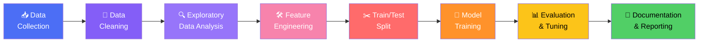

# 🏠 Project Instructions: House Price Prediction

## 📌 Short Info About the Data

- **Dataset type:** Structured/tabular real estate data
- **Typical features:** Location, area/square footage, number of bedrooms & bathrooms, age of property, amenities, proximity to city center, furnishing status, etc.
- **Target variable:** `Price` (continuous numeric value) → this is a **Regression** problem
- **Suggested sources:** Kaggle ("House Prices - Advanced Regression Techniques", "Bengaluru House Price Data", or any local housing dataset)
- **Data format:** CSV file with mixed numeric and categorical columns, likely containing missing values and outliers

---

## 🎯 Aim of the Project

To build a regression model that accurately predicts the **selling price of a house** based on its physical, locational, and structural attributes, while understanding how each feature contributes to the final price.

---

## 📈 Expected Outcomes

- A trained regression model capable of predicting house prices with a reasonable error margin (evaluated using RMSE/MAE/R²)
- Clear insight into **which features most influence house price** (e.g., feature importance/coefficients)
- A clean, reproducible notebook that documents the entire journey from raw data to final model
- A short written analysis of model performance and limitations

---

## 🔄 Traditional Machine Learning Workflow

1. **Data Collection** — Gather/load the housing dataset
2. **Data Cleaning** — Handle missing values, duplicates, incorrect entries
3. **Exploratory Data Analysis (EDA)** — Understand distributions, relationships, and outliers
4. **Feature Engineering** — Create, transform, and select the most useful features
5. **Train/Test Split** — Separate data to evaluate generalization
6. **Model Training** — Fit regression algorithms on the training data
7. **Evaluation & Tuning** — Measure performance and optimize hyperparameters
8. **Documentation & Reporting** — Summarize approach, results, and insights

---

## 🧹 Data Preprocessing

- Handle missing values (imputation using mean/median/mode, or drop if justified)
- Remove or treat duplicate records
- Detect and handle outliers (e.g., extremely high/low prices, unrealistic square footage) using IQR or z-score methods
- Correct data types (e.g., converting strings to numeric where needed)
- Standardize inconsistent categorical labels (e.g., "Bangalore" vs "bangalore")

---

## 🛠️ Feature Engineering

- Encode categorical variables (One-Hot Encoding, Label Encoding, or Target Encoding)
- Create derived features (e.g., `price_per_sqft`, `house_age`, `total_rooms`)
- Handle multicollinearity (correlation analysis, VIF)
- Feature scaling/normalization (StandardScaler, MinMaxScaler) — especially important for linear models
- Feature selection (correlation threshold, Recursive Feature Elimination, or feature importance from tree-based models)

---

## 🔍 Exploratory Data Analysis (EDA)

- Distribution of target variable (`Price`) — check skewness, apply log-transform if needed
- Univariate analysis of numeric and categorical features
- Bivariate analysis: feature vs. price (scatter plots, box plots)
- Correlation heatmap to identify strongly related features
- Outlier visualization (box plots)
- Missing value visualization (heatmap or bar chart of null counts)

---

## 📚 Concepts You Need to Learn for This Project

- **Statistics fundamentals:** mean, median, variance, standard deviation, skewness, correlation
- **Regression algorithms:** Linear Regression, Ridge Regression, Lasso Regression, Decision Tree Regressor, Random Forest Regressor, Gradient Boosting (XGBoost/LightGBM)
- **Regularization:** L1 (Lasso) vs L2 (Ridge) and why they matter for multicollinearity/overfitting
- **Feature engineering techniques:** encoding, scaling, transformation (log/box-cox)
- **Model evaluation metrics for regression:** MAE, MSE, RMSE, R², Adjusted R²
- **Cross-validation:** k-fold cross-validation for reliable performance estimates
- **Hyperparameter tuning:** Grid Search, Random Search
- **Bias-variance tradeoff** and how it relates to model complexity
- **Data visualization:** Matplotlib, Seaborn for EDA plots

---

## ✅ What's Expected From Contributors

Every contribution to this project **must** include the following three deliverables:

### 1. 📓 Colab / Jupyter Notebook
- Clean, well-commented, and runnable top-to-bottom without errors
- Organized into clear sections: Imports → Data Loading → EDA → Preprocessing → Feature Engineering → Modeling → Evaluation → Conclusion
- Use markdown cells to explain reasoning at each step, not just code

### 2. 💾 Saved Model
- Export the final trained model using `pickle` or `joblib` (e.g., `house_price_model.pkl`)
- Include the preprocessing pipeline/scaler/encoder objects if used at inference time
- Add a small script or notebook cell showing how to load the model and make a sample prediction

### 3. 📝 Documentation of Code & Results (Mini Research Paper Style)
A short report (Markdown or PDF) structured like a mini research paper, including:

| Section | Content |
|---|---|
| **Abstract** | 3-4 sentence summary of the problem, approach, and key result |
| **Introduction** | Problem statement and motivation |
| **Dataset Description** | Source, size, features, target variable |
| **Methodology** | Preprocessing, feature engineering, and modeling approach used |
| **Results** | Evaluation metrics, comparison of models tried, best model justification |
| **Discussion** | Key insights, feature importance findings, limitations |
| **Conclusion** | Summary and possible future improvements |
| **References** | Dataset source, articles/papers referenced (if any) |

> 💡 Tip: Keep the report concise (1-3 pages) but precise — it should let someone understand your entire approach and results without opening the notebook.
