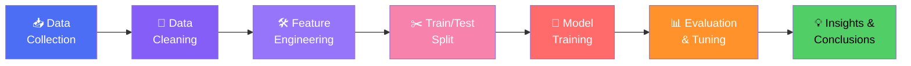

<div align="center">

# 🤖 Machine Learning Projects

### Learning Machine Learning Through Real Projects

*Hands-on implementations that teach ML concepts by building, not just reading.*


</div>

---

## 🗺️ Table of Contents

- [Overview](#-overview)
- [Project Index](#-project-index)
- [Getting Started](#-getting-started)
- [ML Workflow](#-ml-workflow)
- [Concepts Covered](#-concepts-covered)
- [Model Evaluation Cheatsheet](#-model-evaluation-cheatsheet)
- [How to Use](#-how-to-use)
- [Contributing](#-contributing)
- [License & Contact](#-license--contact)

---

## 📚 Overview

This is a **project-based learning repository** for Machine Learning. Instead of isolated theory notebooks, every concept here is taught through a **real, end-to-end project** — from raw data to a working, evaluated model.

> 💡 **Philosophy:** The best way to learn ML is to build it, break it, debug it, and understand *why* it works.

Currently, this repository includes two projects, with more planned as the learning journey continues.

---

## 📂 Project Index

| # | Project | Type | Key Algorithms | Status |
|---|---|---|---|---|
| 01 | 🏠 House Price Prediction | Regression | Linear Regression, Ridge/Lasso | ✅ Complete |
| 02 | 💳 Credit Card Fraud Detection | Classification (Imbalanced) | Logistic Regression, Random Forest, SMOTE | ✅ Complete |

**Legend:** ✅ Complete &nbsp;|&nbsp; 🚧 In Progress &nbsp;|&nbsp; 📝 Planned

<details open>
<summary><b>🏠 01. House Price Prediction</b></summary>
<br>

**Goal:** Predict housing prices based on features like location, size, and amenities.

- **Type:** Supervised Learning — Regression
- **Concepts:** Feature engineering, handling missing data, multicollinearity, regularization
- **Algorithms:** Linear Regression, Ridge Regression, Lasso Regression
- **Evaluation:** MAE, MSE, RMSE, R²

</details>

<details open>
<summary><b>💳 02. Credit Card Fraud Detection</b></summary>
<br>

**Goal:** Identify fraudulent transactions in a highly imbalanced dataset.

- **Type:** Supervised Learning — Classification
- **Concepts:** Class imbalance, resampling techniques, precision-recall tradeoffs
- **Algorithms:** Logistic Regression, Random Forest, SMOTE for oversampling
- **Evaluation:** Precision, Recall, F1-score, ROC-AUC, PR-AUC

</details>

---

## 🚀 Getting Started

### ✅ Prerequisites

| Requirement | Details |
|---|---|
| 🐍 Python | 3.7+ |
| 📓 Jupyter Notebook | Latest |
| 📦 Libraries | NumPy, Pandas, Matplotlib, Seaborn, Scikit-learn |

### ⚙️ Installation

```bash
# Clone the repository
git clone https://github.com/INCYBIC-TC/LLM_from_scratch.git
cd "LLM_from_scratch/machine learning"

# Install dependencies
pip install -r requirements.txt

# Launch Jupyter
jupyter notebook
```

---

## 🔄 ML Workflow

Every project in this repo follows the same end-to-end process:



---

## 🧠 Concepts Covered

<details open>
<summary><b>📈 Regression (House Price Prediction)</b></summary>
<br>

- Exploratory Data Analysis (EDA) & correlation analysis
- Handling missing values & outliers
- Encoding categorical variables
- Regularization: Ridge (L2) & Lasso (L1)
- Model evaluation: MAE, RMSE, R²

</details>

<details open>
<summary><b>🔍 Classification & Imbalanced Data (Fraud Detection)</b></summary>
<br>

- Working with highly imbalanced datasets
- Resampling techniques: SMOTE, undersampling
- Ensemble methods: Random Forest
- Precision-Recall tradeoffs vs. plain Accuracy
- ROC-AUC & PR-AUC curves

</details>

<details open>
<summary><b>🛠️ Shared Foundations</b></summary>
<br>

- Data cleaning & preprocessing pipelines
- Feature scaling & normalization
- Train/test splitting & cross-validation
- Hyperparameter tuning (Grid Search, Random Search)
- Bias-variance tradeoff

</details>

---

## 📏 Model Evaluation Cheatsheet

| Task Type | Common Metrics |
|---|---|
| Regression | MAE, MSE, RMSE, R² |
| Classification | Accuracy, Precision, Recall, F1-score, ROC-AUC |
| Imbalanced Classification | PR-AUC, F1-score, Confusion Matrix |

---

## 📖 How to Use

Each project notebook follows a consistent format:

| Section | What You'll Find |
|---|---|
| 🎯 **Problem Statement** | What we're solving and why it matters |
| 🔍 **Exploratory Data Analysis (EDA)** | Visualizations & statistical summaries |
| 🛠️ **Preprocessing** | Cleaning, encoding, scaling steps |
| 🤖 **Modeling** | Algorithm implementation & training |
| 📊 **Evaluation** | Metrics, plots, and result interpretation |
| 💡 **Key Takeaways** | What the model tells us about the data |

> Open any notebook from the [Project Index](#-project-index) and run the cells top-to-bottom to reproduce results.

---

## 🤝 Contributing

Contributions are welcome! Feel free to:

- 🐛 Report issues or bugs
- 📓 Add a new project (please update the [Project Index](#-project-index))
- 💡 Suggest new algorithms or datasets
- 📝 Improve documentation or add visualizations

---

## 📝 License & Contact

This project is **open source** and available for **educational purposes**.

📧 For questions or suggestions, please reach out through the repository [issues](https://github.com/INCYBIC-TC/LLM_from_scratch/issues).

---

<div align="center">

### Happy Learning! 🚀

⭐ **If you find this useful, consider starring the repo!** ⭐

</div>
