<div align="center">

# 🔄 GitHub Workflow — Step-by-Step

### For students contributing to this repository

*A quick command reference: from forking to opening your first Pull Request.*

</div>

---

## 🗺️ Overview

```mermaid
flowchart LR
    A["1. Fork"] --> B["2. Clone"]
    B --> C["3. Add upstream"]
    C --> D["4. Create branch"]
    D --> E["5. Setup env"]
    E --> F["6. Do the work"]
    F --> G["7. Commit"]
    G --> H["8. Push"]
    H --> I["9. Open PR"]
    I --> J["10. Cleanup\nafter merge"]

    style A fill:#4C6EF5,color:#fff
    style B fill:#4C6EF5,color:#fff
    style C fill:#4C6EF5,color:#fff
    style D fill:#845EF7,color:#fff
    style E fill:#845EF7,color:#fff
    style F fill:#F783AC,color:#fff
    style G fill:#FF922B,color:#fff
    style H fill:#FF922B,color:#fff
    style I fill:#FCC419,color:#000
    style J fill:#51CF66,color:#000
```



> ⚡ Steps 1–3 are **one-time setup**. Steps 4–10 you repeat for **every new contribution**.

---

## 1️⃣ Fork the repo

On GitHub, click **Fork** (top-right of the repo page) — this creates a copy under your own account.

---

## 2️⃣ Clone your fork

```bash
git clone https://github.com/<your-github-username>/Machine_learning_Projects.git
cd Machine_learning_Projects
```

---

## 3️⃣ Add the original repo as upstream

```bash
git remote add upstream https://github.com/tusharchothe/Machine_learning_Projects.git
```

Verify your remotes:
```bash
git remote -v
```

---

## 4️⃣ Create your branch (use your GitHub username)

```bash
git checkout -b <your-github-username>/add-your-project-name
```

**Example:**
```bash
git checkout -b riya123/add-diabetes-prediction
```

> 📌 Always prefix your branch with your GitHub username — multiple students contribute here, so this avoids naming clashes and makes ownership clear.

---

## 5️⃣ Set up your environment

```bash
python -m venv venv
source venv/bin/activate      # Windows: venv\Scripts\activate
pip install -r requirements.txt
jupyter notebook
```

---

## 6️⃣ Do your work

- Build your notebook: EDA → preprocessing → feature engineering → modeling → evaluation
- Save your trained model (`.pkl` / `.joblib`)
- Write your short report/documentation (mini research paper style)

> See each project's `instructions.md` for exact data, aim, and deliverable requirements.

---

## 7️⃣ Stage and commit your changes

```bash
git add .
git commit -m "Add diabetes prediction notebook with EDA and model comparison"
```

> Write clear, present-tense commit messages describing what the change does.

---

## 8️⃣ Push your branch to your fork

```bash
git push origin <your-github-username>/add-your-project-name
```

---

## 9️⃣ Open a Pull Request

1. Go to your fork on GitHub
2. Click **"Compare & pull request"**
3. Set the base repo/branch to `tusharchothe/Machine_learning_Projects` → `main`
4. Add a clear title and description of what you did
5. Click **Create pull request**

---

## 🔟 After your PR is merged (cleanup)

```bash
git checkout main
git pull upstream main
git branch -d <your-github-username>/add-your-project-name
git push origin --delete <your-github-username>/add-your-project-name
```

---

## 🔁 Keeping your fork updated (do this before starting new work)

```bash
git checkout main
git fetch upstream
git merge upstream/main
git push origin main
```

---

<div align="center">

### That's it — happy contributing! 🚀

</div>
